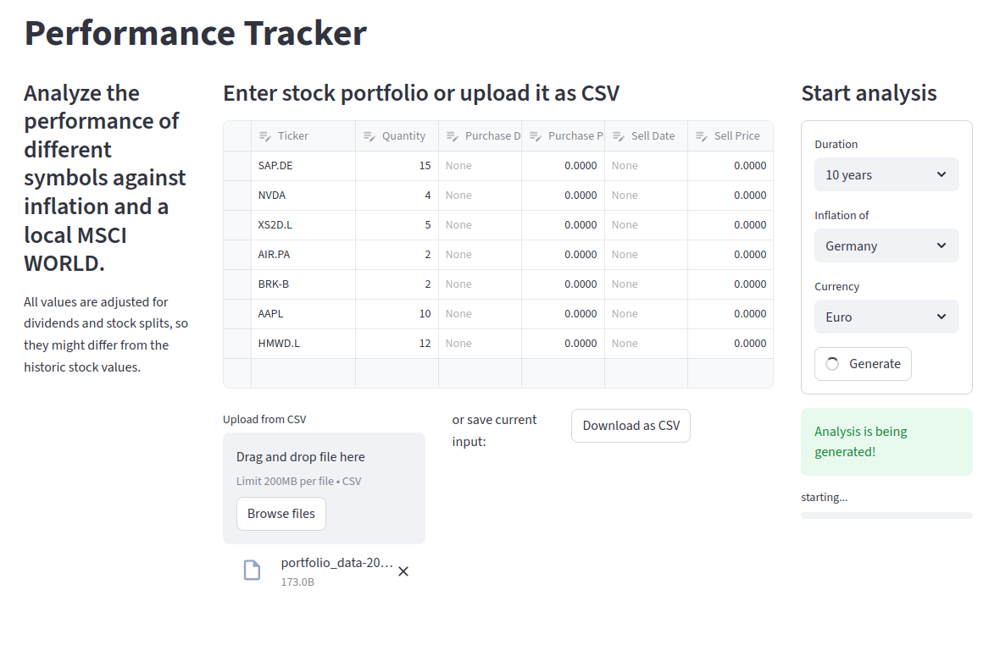

# Performance-Tracker

 [](https://github.com/MaximilianBoehmichen/Performance-Tracker/actions/workflows/unittests.yml) 

The **Performance Tracker** is a MSCI World ETF advocate. Compare individual stocks against a local ETF and inflation, but adjusted for different currencies and dividends. This is intended for research and educational use only. The output may not be redistributed, according to Yahoo! finance API TOS!

---
The ui runs with [streamlit](https://github.com/streamlit/streamlit), data is sourced from [yfinance](https://github.com/ranaroussi/yfinance), and the report is rendered with LaTeX.

### Input


### Output
No example output is provided, as the utilized data may not be redistributed. However, example input is provided in 

### Install:
```
# install the repo
git clone https://github.com/MaximilianBoehmichen/Performance-Tracker
cd Performance-Tracker

# install latex
sudo apt update
sudo apt install texlive-full

# run
uv sync
streamlit run src/performance_tracker/main.py  

```

### Roadmap
The current state is a Proof of Concept, some functionality is in an early state or missing.

- [x] ✅ usable working concept 
- [ ] 🔬 add significant test coverage
- [ ] 💸 support different countries and currencies than Germany and Euro
- [ ] 💬 compliant AI integration to assess data 

---

> [!IMPORTANT]
> Financial Data is accessed from yfinance and Worldbank. The Yahoo! finance API is intended for personal use only. Any data may not be redistributed. Performance-Tracker is an open-source tool and is not affiliated with, endorsed by, or vetted by Yahoo, Inc.. 

> [!CAUTION]
> **Performance Tracker** does not provide financial advice. The utilized data is not guaranteed to be complete or correct!

---

You should refer to Yahoo!'s terms of use
[
[1](https://policies.yahoo.com/us/en/yahoo/terms/product-atos/apiforydn/index.htm),
[2](https://legal.yahoo.com/us/en/yahoo/terms/otos/index.html), and
[3](https://policies.yahoo.com/us/en/yahoo/terms/index.htm)
]
for details on your rights to use the downloaded data.
